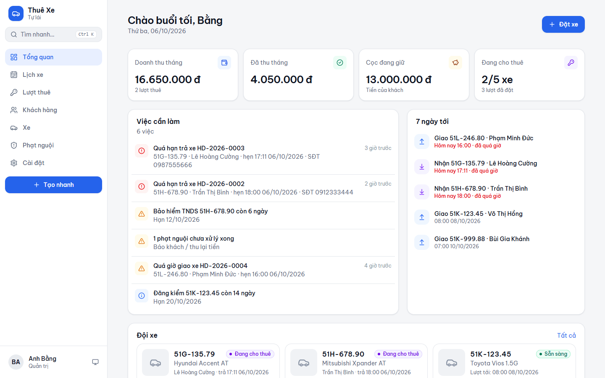
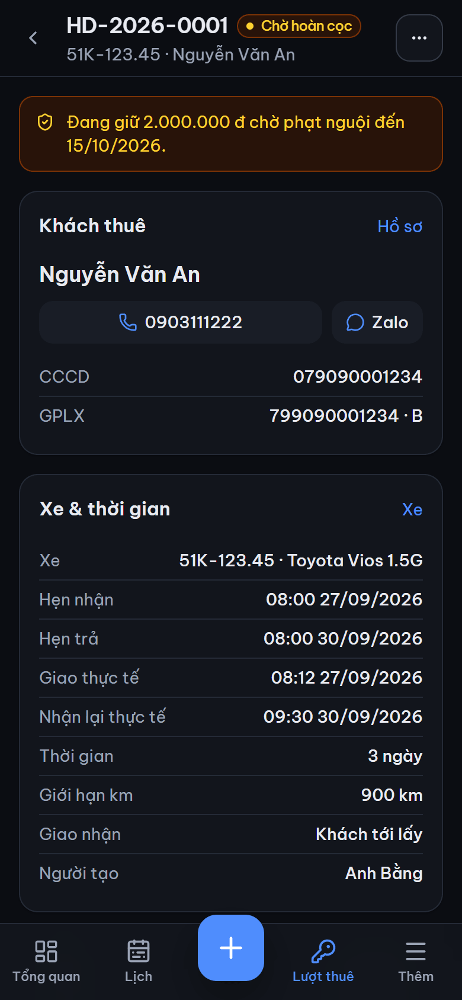
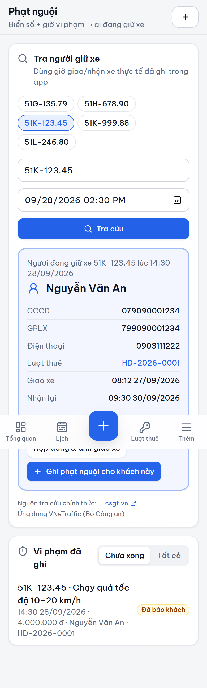
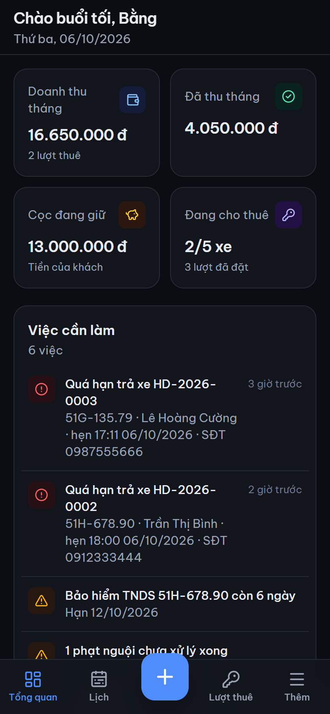
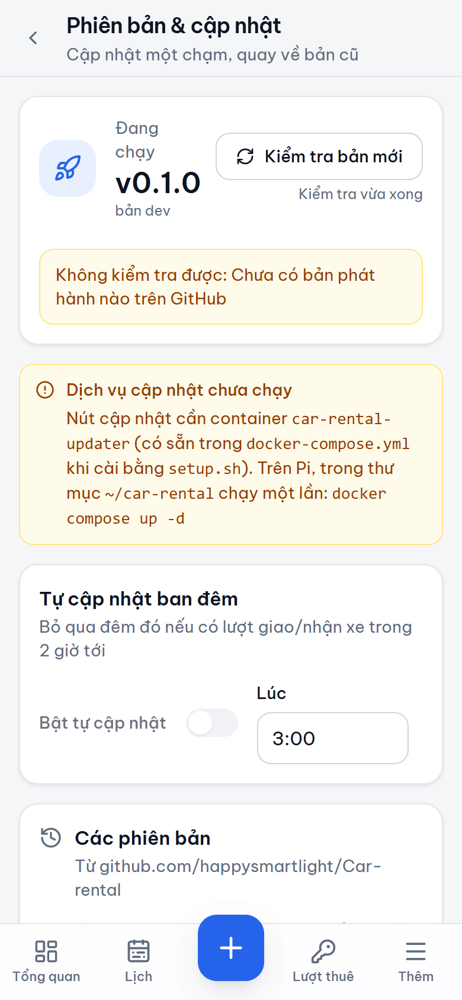
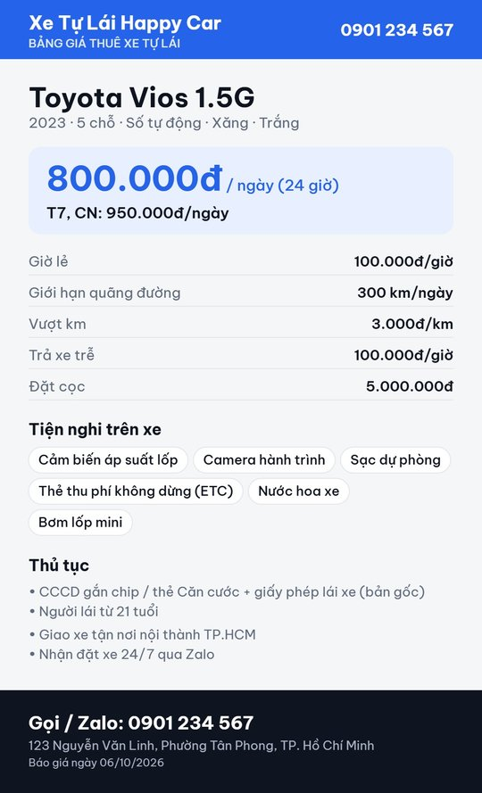
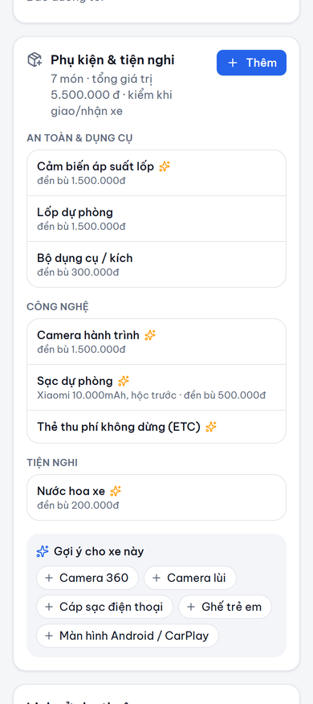
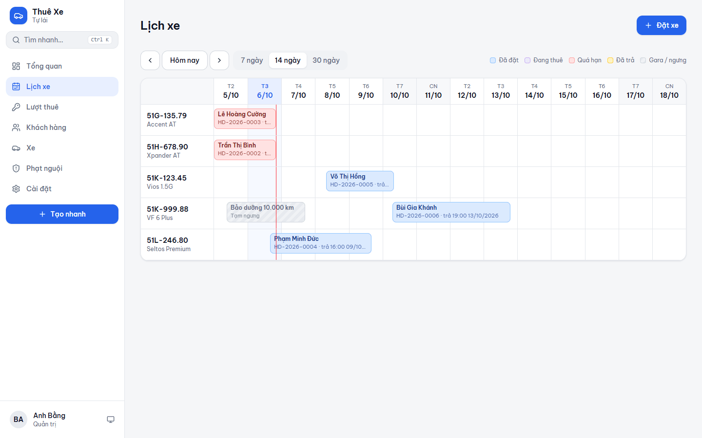

# Car Rental — quản lý cho thuê xe tự lái

Web app tự host trên Raspberry Pi 5 để chạy dịch vụ cho thuê xe tự lái: xe, khách,
đặt xe, hợp đồng tự động, giao/nhận xe có ảnh, quyết toán cọc và **tra ngược phạt nguội**.
Dùng như app trên điện thoại (PWA), truy cập qua Tailscale. Cập nhật ngay trong app,
không cần mở terminal.

📖 [Kế hoạch & lộ trình](docs/PLAN.md) · [Kiến trúc](docs/ARCHITECTURE.md) ·
[Quy ước giao diện](docs/DESIGN.md) · [Việc còn treo](docs/BACKLOG.md) · [Thay đổi](CHANGELOG.md)

<p align="center">
  
  &nbsp;
  
</p>

<table>
  <tr>
    <td width="33%"><p align="center"><b>Tra phạt nguội</b></p></td>
    <td width="33%"><p align="center"><b>Tổng quan (tối)</b></p></td>
    <td width="33%"><p align="center"><b>Cập nhật trong app</b></p></td>
  </tr>
</table>

<table>
  <tr>
    <td width="50%"><p align="center"><b>Ảnh bảng giá gửi khách</b></p></td>
    <td width="50%"><p align="center"><b>Phụ kiện & gợi ý</b></p></td>
  </tr>
</table>



## Tính năng

| | |
|---|---|
| **Khách hàng** | Quét QR trên CCCD gắn chip / thẻ Căn cước để điền form (đọc ngay trên máy, không gửi ảnh đi đâu). Ảnh CCCD, GPLX. Báo trùng hồ sơ. Danh sách đen. Lịch sử thuê. |
| **Đặt xe** | Báo giá trực tiếp: ngày thường / cuối tuần / lễ Tết, giờ lẻ, giới hạn km, **thuê tháng** (tự chọn cách tính rẻ hơn). Thấy xe nào trống. Chặn trùng lịch (có khoảng đệm rửa xe). Cảnh báo GPLX hết hạn, khách còn nợ phạt nguội. Lái phụ, cọc, tài sản thế chấp. |
| **Hợp đồng tự động** | Mẫu Word (.docx) chèn biến `{khach.ho_ten}`… → xuất Word + PDF. Số tiền bằng chữ. Văn bản đã in được đóng băng, lưu ảnh bản giấy đã ký. 3 mẫu dựng sẵn: hợp đồng, biên bản giao xe, biên bản nhận xe & quyết toán. |
| **Giao / nhận xe** | Trên điện thoại: ODO, mức xăng, 6 khung ảnh đóng dấu giờ + biển số, vết trầy có sẵn, giấy tờ kèm theo, khách ký trên màn hình. Lúc nhận xe so ảnh trước/sau, tự gợi ý phí trễ giờ, vượt km. |
| **Tiền** | Sổ thu/chi từng lượt, VietQR đúng số tiền + nội dung, quyết toán cấn trừ cọc, **giữ lại một phần cọc chờ phạt nguội** rồi nhắc hoàn. |
| **Phạt nguội** | Chọn biển số → Kiểm tra: mỗi vi phạm tìm được tự hiện người đang giữ xe lúc đó (theo giờ giao/nhận thực tế), ghi hồ sơ một chạm. Dịch vụ tra cứu lỗi thì dán kết quả từ trang chính thức. Tự kiểm tra cả đội hằng ngày/tuần, báo Telegram. Có thông báo giấy thì tra theo giờ. Trừ cọc. |
| **Xe** | Bảng giá riêng, hạn đăng kiểm / bảo hiểm / phí đường bộ, mốc bảo dưỡng, lịch gara. Lịch xe dạng timeline. |
| **Phụ kiện** | Danh mục dùng chung (gõ không dấu, tên gọi khác như "tpms"), gợi ý theo xe cùng dòng / cả đội / xe điện, chép từ xe khác. Tự vào checklist giao/nhận và hợp đồng; nhận xe thiếu món nào thì đề xuất khoản đền bù theo giá trị đã khai. |
| **Chia sẻ cho khách** | Ảnh bảng giá một xe hoặc cả đội + tin nhắn chữ để dán Zalo; gửi bằng nút chia sẻ của điện thoại (khách không cần vào app). |
| **Thông báo** | Telegram: đặt xe mới, giao/nhận xe, sắp đến giờ trả, quá hạn, bản tin buổi sáng, có bản cập nhật. |
| **Sao lưu** | Hằng đêm trên Pi + gửi Telegram **có mã hóa**; khôi phục trên giao diện. |
| **Cập nhật** | Phát hiện bản mới kèm ghi chú, cập nhật một chạm, tự cập nhật ban đêm (né giờ giao/nhận xe), tự quay về khi bản mới lỗi, quay về bản cũ kèm dữ liệu. |
| **Hệ thống** | Quản trị / nhân viên, nhật ký thao tác (ghi cả lần xem ảnh CCCD), sáng/tối, cài lên màn hình điện thoại. |

## Cài lên Raspberry Pi

Yêu cầu: Pi 5 (DietPi / Raspberry Pi OS 64-bit), có Tailscale. Chạy một lần:

```bash
curl -fsSL https://raw.githubusercontent.com/happysmartlight/car-rental/main/deploy/setup.sh | sudo bash
```

Script cài Docker nếu thiếu, tạo `~/car-rental` (`docker-compose.yml`, `.env`, `data/`),
kéo image, chạy stack và mở HTTPS qua Tailscale ở cổng **3002**:
`https://dietpi.<tailnet>.ts.net:3002`. Lần đầu mở trang sẽ hỏi tạo tài khoản quản trị.

> Camera (quét QR căn cước) chỉ chạy qua **https**. Dùng địa chỉ Tailscale, không dùng `http://192.168.x.x`.

Stack gồm 3 container: `car-rental` (app), `car-rental-gotenberg` (đổi Word → PDF, chỉ mạng nội bộ),
`car-rental-updater` (nút Cập nhật). Dữ liệu nằm hết trong `~/car-rental/data/`.

### Lần đầu phát hành (cho chủ repo)

1. Repo **public** (runner ARM64 miễn phí của GitHub chỉ dành cho repo public; image build thẳng cho Pi, không qua giả lập).
2. Phát hành: thêm mục vào `CHANGELOG.md`, rồi `npm run release -- 0.1.0` và `git push && git push --tags`.
   GitHub Actions build image `ghcr.io/happysmartlight/car-rental:0.1.0` + tạo Release.
3. Lần đầu: vào GitHub → Packages → `car-rental` → Package settings → **Change visibility → Public**
   (nếu không, Pi cần `docker login ghcr.io`).

### Cập nhật

Cài đặt → **Phiên bản & cập nhật**. App kiểm tra GitHub Releases mỗi 6 giờ và báo qua Telegram.
Bấm cập nhật: app sao lưu DB → updater kéo image mới → khởi động lại → chờ app báo đúng phiên bản.
Lỗi → tự quay về bản cũ và khôi phục DB. Chi tiết: [docs/ARCHITECTURE.md](docs/ARCHITECTURE.md#cập-nhật).

## Phát triển

```bash
npm install
npm run dev:api        # API ở :3002 (dữ liệu trong ./data)
npm run dev:web        # giao diện ở :5173, proxy /api → :3002
npm test               # unit + tích hợp (DB tạm)
npm run typecheck
npm run seed:demo      # dữ liệu mẫu: DATA_DIR=./data-demo, đăng nhập admin / demo12345
```

Sửa lược đồ DB (`apps/api/src/db/schema.ts`) → `npm run db:generate` để sinh migration.
Sửa nội dung mẫu Word dựng sẵn → `npm run templates -w apps/api`.
Quy ước cho người và AI khi sửa code: [CLAUDE.md](CLAUDE.md).

## Lưu ý pháp lý

Mẫu hợp đồng dựng sẵn chỉ là điểm xuất phát, không phải tư vấn luật — nên nhờ người có chuyên môn
xem lại điều khoản phạt nguội, hư hỏng, cọc. Ảnh CCCD/GPLX là dữ liệu cá nhân: app chỉ cho xem khi
đăng nhập, ghi nhật ký mỗi lần xem, bản sao lưu gửi ra ngoài Pi được mã hóa.
